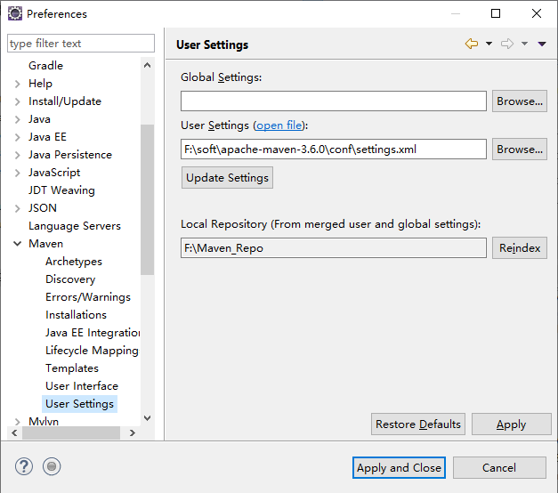

### Eclipse引用本地Maven
--------

#### 修改eclipse引用maven配置
* 依次打开`Window --> Preferences --> Maven --> User Settings`，修改eclipse默认配置为本地maven

* 依次打开`Window --> Show View --> Other... --> Maven --> Maven Repositories`，重建索引

  
[首页](../../README.md)  [Maven](Maven.md)
