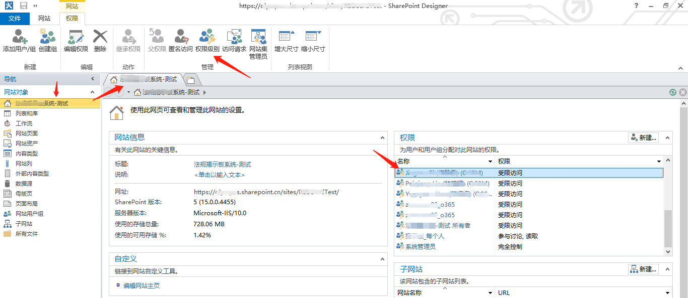
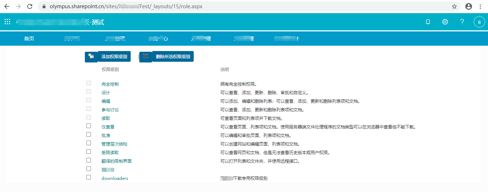

### SharePoint 权限配置

#### 方案一
* 在角色中配置相应的角色，在后台代码刷用户角色权限，在前台代码获取是否有相应的角色权限
  * 角色配置页面打开方式
  
  * 角色配置页面(downloaders为自定义的角色)
  
  * 参考链接
      ```url
      https://olympus.sharepoint.cn/sites/xxxxTest/_layouts/15/role.aspx
      ```
  * 后台刷权限代码（参考）
    ```C#
    using ConditionService;
    using Microsoft.SharePoint.Client;
    using System;
    using System.Collections.Generic;
    using System.Linq;
    using System.Web;
    using System.Web.Services;
    using CTECServices.Library;
    using System.Configuration;
    using Newtonsoft.Json;
    using Newtonsoft.Json.Linq;

    namespace ServicesName
    {
        /// <summary>
        /// SetFolderPermissions 的摘要说明
        /// </summary>
        [WebService(Namespace = "http://tempuri.org/")]
        [WebServiceBinding(ConformsTo = WsiProfiles.BasicProfile1_1)]
        [System.ComponentModel.ToolboxItem(false)]
        // 若要允许使用 ASP.NET AJAX 从脚本中调用此 Web 服务，请取消注释以下行。 
        [System.Web.Script.Services.ScriptService]
        public class SetFolderPermissions : System.Web.Services.WebService
        {
            [WebMethod]
            public string HelloWorld()
            {
                return "Hello World";
            }

            // 管理列表只记录管理信息，具体的权限仍然是刷新到具体的存储数据的列表上
            //查询到具体item并打破权限重新赋予权限
            public void SetPermissionsDemo(int itemId, ListItem ClassificationItem, ClientContext context, List MessageList)
            {
                // 查询到具体item并打破权限重新赋予权限
                ListItem Messageitem = MessageList.GetItemById(itemId); // itemId：具体的列表中项目
                context.Load(Messageitem, i => i.HasUniqueRoleAssignments);
                context.Load(Messageitem);
                context.ExecuteQuery();
                // 重新继承父级权限
                Messageitem.ResetRoleInheritance();
                // 断开继承
                Messageitem.BreakRoleInheritance(false, false);
                
                // 下载用户为例，其他非必要代码已删除
                if (ClassificationItem["DownloadUsers"] != null)
                {
                    FieldUserValue[] flvMember = ClassificationItem["DownloadUsers"] as FieldUserValue[];
                    foreach (FieldUserValue Member in flvMember)
                    {
                        Principal pd = context.Web.SiteUsers.GetById(Member.LookupId);
                        RoleDefinition rd = context.Web.RoleDefinitions.GetByName("downloaders");
                        RoleDefinitionBindingCollection rdbc = new RoleDefinitionBindingCollection(context);
                        rdbc.Add(rd);
                        Messageitem.RoleAssignments.Add(pd, rdbc);
                    }
                }
                // 系统管理员权限
                Principal Allp = context.Web.SiteGroups.GetByName("系统管理员");
                if (Allp != null)
                {
                    RoleDefinition rd = context.Web.RoleDefinitions.GetByName("参与讨论");
                    RoleDefinitionBindingCollection rdbc = new RoleDefinitionBindingCollection(context);
                    rdbc.Add(rd);
                    Messageitem.RoleAssignments.Add(Allp, rdbc);
                }
                Messageitem.Update();
                context.Load(Messageitem);
                context.ExecuteQuery();
            }
        }
    }
    ```
  * 前台使用代码（参考）
    ```javascript
    function startJs()
    {
        ExecuteOrDelayUntilScriptLoaded(GetCurrentItemPermission, "sp.js");
    }

    //查询权限
    function GetCurrentItemPermission() {
        var CurrentItemID = GetQueryString("ID"); // ID：列表项目id（itemId）
        var siteUrl = _spPageContextInfo.webServerRelativeUrl;
        var contextMessage = new SP.ClientContext(siteUrl);
        // _spPageContextInfo.listTitle ： 列表名称
        var listCategory = contextMessage.get_web().get_lists().getByTitle(_spPageContextInfo.listTitle);
        this.currentitempermission = listCategory.getItemById(CurrentItemID);
        // 加载有效的基本权限
        contextMessage.load(this.currentitempermission, 'EffectiveBasePermissions');
        contextMessage.executeQueryAsync(
            Function.createDelegate(this, this.GetCurrentPermissionSucceeded),
            Function.createDelegate(this, this.GetCurrentPermissionFailed)
        );
    }

    function GetCurrentPermissionSucceeded() {
        var perms = this.currentitempermission.get_effectiveBasePermissions();
        if (perms.has(SP.PermissionKind.browseDirectories)) {
            // 具有某个权限后进行具体的操作
            IsDownloaders = true;
            jQuery("#exportbuttonid").show();
        }
    }
    ```
  * 权限参考

| 权限名称                | 权限详情 |
| :---------------------- | :------------------------------------------------------------ |
| ViewListItems          | 查看项目  - 查看列表中的项目、文档库中的文档和查看 Web 讨论评论。 |
| OpenItems              | 打开项目  - 使用服务器端文件处理程序查看文档源。             |
| ViewVersions           | 查看版本  - 查看列表项或文档的以前版本。                     |
| CreateAlerts           | 创建通知  - 创建电子邮件通知。                               |
| ViewFormPages          | 查看应用程序页面  - 查看表单、视图和应用程序页面。枚举列表。 |
| ViewPages              | 查看网页  - 查看网站中的网页。                               |
| BrowseUserInfo         | 浏览用户信息  - 查看有关网站用户的信息。                     |
| UseRemoteAPIs          | 使用远程接口  - 使用 SOAP、Web DAV 或 SharePoint Designer 接口访问网站。 |
| UseClientIntegration   | 使用客户端集成功能  - 使用启动客户端应用程序的功能。如果没有此权限，用户必须本地处理文档并上载更改。 |
| Open                   | 打开  - 允许用户打开网站、列表或文件夹，以便访问该容器中的项目。 |
| ManageLists            | 管理列表  - 创建和删除列表，添加或删除列表中的栏，以及添加或删除列表的公共视图。 |
| CancelCheckout         | 替代签出版本  - 放弃或签入已由其他用户签出的文档。           |
| AddListItems           | 添加项目  - 向列表中添加项目，向文档库中添加文档，以及添加 Web 讨论评论。 |
| EditListItems          | 编辑项目  - 编辑列表中的项目、文档库中的文档、文档中的 Web 讨论评论以及自定义文档库中的 Web 部件页。 |
| DeleteListItems        | 删除项目  - 从列表中删除项目、从文档库中删除文档，以及删除文档中的 Web 讨论评论。 |
| ApproveItems           | 批准项目  - 批准列表项或文档的次要版本。                     |
| DeleteVersions         | 删除版本  - 删除列表项或文档的以前版本。                     |
| ManagePermissions      | 管理权限  - 创建和更改网站上的权限级别，并为用户和用户组分配权限。 |
| ViewUsageData          | 查看使用率数据  - 查看有关网站使用率的报告。                 |
| ManageSubwebs          | 创建子网站  - 创建子网站，例如工作组网站、会议工作区网站和文档工作区网站。 |
| ManageWeb              | 管理网站  - 授予执行该网站的所有管理任务并管理内容的能力。   |
| AddAndCustomizePages   | 添加和自定义网页  - 添加、更改或删除 HTML 网页或 Web 部件页，并使用与 Windows SharePoint Services 兼容的编辑器编辑网站。 |
| ApplyThemeAndBorder    | 应用主题和边框  - 将主题或边框应用于整个网站。               |
| ApplyStyleSheets       | 应用样式表  - 将样式表(.CSS 文件)应用于网站。                |
| CreateGroups           | 创建用户组  - 创建一个用户组，该用户组可用于网站集中的任何位置。 |
| BrowseDirectories      | 浏览目录  - 使用 SharePoint Designer 和 Web DAV 接口枚举网站中的文件和文件夹。 |
| EnumeratePermissions   | 枚举权限  - 枚举网站、列表、文件夹、文档或列表项中的权限。   |
| ManageAlerts           | 管理通知  - 管理网站中所有用户的通知。                       |
| EditMyUserInfo         | 编辑个人用户信息  - 允许用户更改个人用户信息，例如添加图片。 |
| ManagePersonalViews    | 管理个人视图  - 创建、更改和删除列表的个人视图。             |
| AddDelPrivateWebParts  | 添加/删除个人  Web 部件 - 在 Web 部件页中添加或删除个人 Web 部件。 |
| UpdatePersonalWebParts | 更新个人  Web 部件 - 更新 Web 部件以显示个性化信息           |


#### 参考内容
* [SP.PermissionKind Enumeration 英文](https://docs.microsoft.com/en-us/previous-versions/office/developer/sharepoint-2010/ee556747(v=office.14)?redirectedfrom=MSDN)
* [浅谈Sharepoint权限](https://blog.csdn.net/weixin_30578677/article/details/99143105)


[首页](../../README.md) > [学习总览](../../introduction/studyCatalogList.md) > [开发语言](../developmentLanguage/developmentLanguage.md) > [SharePoint](SharePoint.md)
