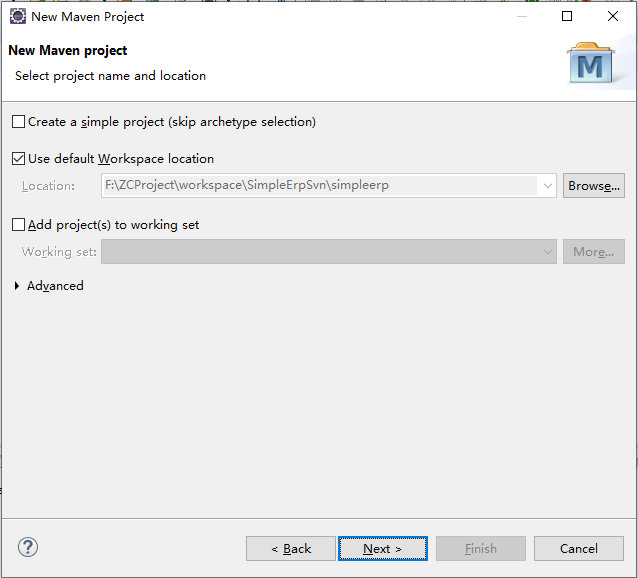
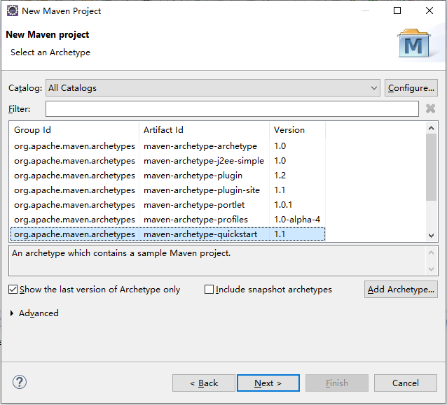
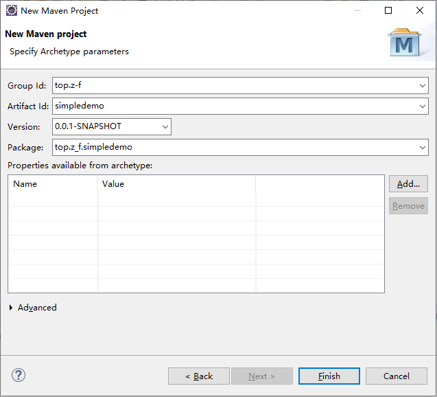

### Eclipse 创建spring boot

#### 方法一：安装STS插件
* 打开eclipse，依次点击`Help-->Eclipse Marketplace...`
* 在弹出画面中搜索*sts*进行安装
* 安装完成后，选择`File-->New-->Project...`
* 在弹出框中搜索*spring*，选择`Spring Starter Project`，然后按照步骤进行创建
* `Run As-->Spring Boot App`进行启动
#### 方法二：创建Maven项目
* 打开Eclipse，依次选择`File-->New-->Project...`
* 在弹出框中搜索*maven*，选择`Maven Project`进行下一步
* 选择项目工作目录  
  
* 选择项目类型  
  
* 编辑项目参数  
  
* 修改pom.xml文件  
```xml
<project xmlns="http://maven.apache.org/POM/4.0.0"
	xmlns:xsi="http://www.w3.org/2001/XMLSchema-instance"
	xsi:schemaLocation="http://maven.apache.org/POM/4.0.0 http://maven.apache.org/xsd/maven-4.0.0.xsd">
	<modelVersion>4.0.0</modelVersion>

	<groupId>top.z-f</groupId>
	<artifactId>simpleerp</artifactId>
	<version>0.0.1-SNAPSHOT</version>
    <!-- 打包类型，可以是jar和war -->
	<packaging>war</packaging>

	<name>simpleerp</name>
	<url>http://maven.apache.org</url>

	<!-- spring boot基本环境 开始 -->
	<parent>
		<groupId>org.springframework.boot</groupId>
		<artifactId>spring-boot-starter-parent</artifactId>
		<version>2.0.2.RELEASE</version>
	</parent>
	<!-- spring boot基本环境 结束 -->

	<properties>
		<project.build.sourceEncoding>UTF-8</project.build.sourceEncoding>
	</properties>

	<dependencies>
		<dependency>
			<groupId>junit</groupId>
			<artifactId>junit</artifactId>
			<scope>test</scope>
		</dependency>
		
		<!-- spring boot Web应用基本环境 开始 -->
		<dependency>
			<groupId>org.springframework.boot</groupId>
			<artifactId>spring-boot-starter-web</artifactId>
		</dependency>
		<!-- spring boot Web应用基本环境 结束 -->
	</dependencies>
	
	<build>
		<finalName>simpleerp</finalName>
		<plugins>
			<!-- spring-boot-maven-plugin插件就是打包spring boot应用的 开始 -->
			<plugin>
				<groupId>org.springframework.boot</groupId>
				<artifactId>spring-boot-maven-plugin</artifactId>
			</plugin>
			<!-- spring-boot-maven-plugin插件就是打包spring boot应用的 结束 -->
		</plugins>
	</build>
	
</project>
```  

* 基本目录
    * `src/main/java`：主要工程目录
    * `src/main/resources`：资源文件目录，各种配置文件，主要配置文件`application.properties`
        * `server.port=8089`：配置运行端口号
    * `src/test/java`：测试目录  

* App.java  
```java
package top.z_f.simpleerp;

import org.springframework.boot.SpringApplication;
import org.springframework.boot.autoconfigure.SpringBootApplication;

/**
 * Hello world!
 *
 */
@SpringBootApplication
public class App 
{
    public static void main( String[] args )
    {
//        System.out.println( "Hello World!" );
        SpringApplication.run(App.class, args);
    }
}
```

* HelloController.java  
```java
package top.z_f.simpleerp.controller;

import org.springframework.web.bind.annotation.RequestMapping;
import org.springframework.web.bind.annotation.RestController;

@RestController
@RequestMapping("hello2")
public class HelloController {
	
	@RequestMapping("")
	public String hello() {
		return "hello world 2.";
	}

}
```

* 右键点击项目或者App.java，选择`Run As-->Spring Boot App`；或者右键单击App.java，选择`Run As-->Java Application`直接执行（如果没有安装sts的情况下，可以用这种方式执行
* 浏览器输入`http://localhost:8089/hello2`查看是否正确返回结果`hello world 2.`
#### 方法三：访问http://start.spring.io/（网速影响较大）
* 访问`http://start.spring.io/`，类似sts新建项目
* 下载新建完成的项目
* 解压后导入eclipse


#### 参考文档
* [eclipse创建springboot项目的三种方法](https://blog.csdn.net/mousede/article/details/81285693)


[首页](../../README.md)  [Java](java.md)
