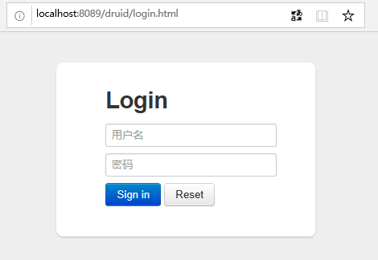

### spring boot使用druid数据库连接池

#### spring boot引入druid
* 修改pom.xml加入druid的jar包
```xml
	<dependencies>		
		……
		<!-- https://mvnrepository.com/artifact/com.alibaba/druid -->
		<dependency>
			<groupId>com.alibaba</groupId>
			<artifactId>druid</artifactId>
			<version>1.1.16</version>
		</dependency>
        ……
	</dependencies>
```

* 修改application.properties文件，将数据库连接类型设置为druid
```properties
    # DB configuation
    # spring boot集成druid，默认hikariCP
    # 数据源
    spring.datasource.type=com.alibaba.druid.pool.DruidDataSource
    # 数据库链接
    spring.datasource.url=jdbc:mysql://xx.xx.xxx.xx:3306/dbName?characterEncoding=utf-8&amp;useSSL=false
    spring.datasource.username=root
    spring.datasource.password=xxxxxx
    spring.datasource.driver-class-name=com.mysql.jdbc.Driver
    # druid 数据源专有配置
    spring.datasource.initialSize = 5
    spring.datasource.minIdle = 5
    #spring.datasource.maxIdle = 10
    spring.datasource.maxActive = 20
    spring.datasource.maxWait = 60000
    spring.datasource.timeBetweenEvictionRunsMillis = 60000
    spring.datasource.minEvictableIdleTimeMillis = 180000
    spring.datasource.validationQuery = SELECT 'x'
    spring.datasource.testWhileIdle = true
    spring.datasource.testOnBorrow = false
    spring.datasource.testOnReturn = false   
    # 打开PSCache，并且指定每个连接上PSCache的大小 
    spring.datasource.poolPreparedStatements = true
    spring.datasource.maxPoolPreparedStatementPerConnectionSize = 20
    # 配置监控统计拦截的filters,stat:监控统计;wall：用于防火墙,防御sql注入;slf4j：日志记录
    spring.datasource.filters = stat,wall,slf4j
    # 合并多个DruidDataSource的监控数据
    spring.datasource.useGlobalDataSourceStat = true
    # 通过connectProperties属性来打开mergeSql功能；慢SQL记录
    spring.datasource.connectionProperties = druid.stat.mergeSql=true;druid.stat.slowSqlMillis=500
```

* 运行项目，执行查询语句，在log中若有`com.alibaba.druid.pool.DruidDataSource`则表示配置成功
#### 配置druid管理台
* 新建`DruidConfiguration`类，用于配置druid管理台
```java
    package top.z_f.simpleerp.druid;

    import com.alibaba.druid.pool.DruidDataSource;
    import com.alibaba.druid.support.http.StatViewServlet;
    import com.alibaba.druid.support.http.WebStatFilter;
    import org.slf4j.Logger;
    import org.slf4j.LoggerFactory;
    import org.springframework.boot.context.properties.ConfigurationProperties;
    import org.springframework.boot.web.servlet.FilterRegistrationBean;
    import org.springframework.boot.web.servlet.ServletRegistrationBean;
    import org.springframework.context.annotation.Bean;
    import org.springframework.context.annotation.Configuration;
    import org.springframework.context.annotation.Primary;
    import javax.sql.DataSource;
    import java.sql.SQLException;

    /**
    * 
    * @author zhangzhen
    * @date 2019-05-29
    *
    */
    @Configuration
    public class DruidConfiguration {

        private static final Logger logger = LoggerFactory.getLogger(DruidConfiguration.class);
        private static final String DB_PREFIX = "spring.datasource";

        @SuppressWarnings({ "rawtypes", "unchecked" })
        @Bean
        public ServletRegistrationBean druidServlet() {
            logger.info("init druid configuration");
            ServletRegistrationBean servletRegistrationBean = new ServletRegistrationBean(new StatViewServlet(),
                    "/druid/*");
            // IP白名单
            servletRegistrationBean.addInitParameter("allow", "192.168.1.100,127.0.0.1"); // 多个配置的时候用逗号分开
    //		// IP黑名单(共同存在时，deny优先于allow)
    //		servletRegistrationBean.addInitParameter("deny", "xxx.xxx.x.xxx");
            // 控制台管理用户
            servletRegistrationBean.addInitParameter("loginUsername", "root");
            servletRegistrationBean.addInitParameter("loginPassword", "1024");
            // 是否能够重置数据 禁用HTML页面上的“Reset All”功能
            servletRegistrationBean.addInitParameter("resetEnable", "false");
            return servletRegistrationBean;
        }

        @SuppressWarnings({ "rawtypes", "unchecked" })
        @Bean
        public FilterRegistrationBean filterRegistrationBean() {
            FilterRegistrationBean filterRegistrationBean = new FilterRegistrationBean(new WebStatFilter());
            filterRegistrationBean.addUrlPatterns("/*");
            filterRegistrationBean.addInitParameter("exclusions", "*.js,*.gif,*.jpg,*.png,*.css,*.ico,/druid/*");
            return filterRegistrationBean;
        }

        // 解决 spring.datasource.filters=stat,wall,slf4j 无法正常注册进去
        @ConfigurationProperties(prefix = DB_PREFIX)
        class IDataSourceProperties {

            private String url;
            private String username;
            private String password;
            private String driverClassName;
            private int initialSize;
            private int minIdle;
            private int maxActive;
            private int maxWait;
            private int timeBetweenEvictionRunsMillis;
            private int minEvictableIdleTimeMillis;
            private String validationQuery;
            private boolean testWhileIdle;
            private boolean testOnBorrow;
            private boolean testOnReturn;
            private boolean poolPreparedStatements;
            private int maxPoolPreparedStatementPerConnectionSize;
            private String filters;
            private String connectionProperties;

            @Bean // 声明其为Bean实例
            @Primary // 在同样的DataSource中，首先使用被标注的DataSource
            public DataSource dataSource() {
                DruidDataSource datasource = new DruidDataSource();
                datasource.setUrl(url);
                datasource.setUsername(username);
                datasource.setPassword(password);
                datasource.setDriverClassName(driverClassName);
                // druid configuration
                datasource.setInitialSize(initialSize);
                datasource.setMinIdle(minIdle);
                datasource.setMaxActive(maxActive);
                datasource.setMaxWait(maxWait);
                datasource.setTimeBetweenEvictionRunsMillis(timeBetweenEvictionRunsMillis);
                datasource.setMinEvictableIdleTimeMillis(minEvictableIdleTimeMillis);
                datasource.setValidationQuery(validationQuery);
                datasource.setTestWhileIdle(testWhileIdle);
                datasource.setTestOnBorrow(testOnBorrow);
                datasource.setTestOnReturn(testOnReturn);
                datasource.setPoolPreparedStatements(poolPreparedStatements);
                datasource.setMaxPoolPreparedStatementPerConnectionSize(maxPoolPreparedStatementPerConnectionSize);
                try {
                    datasource.setFilters(filters);
                } catch (SQLException e) {
                    System.err.println("druid configuration initialization filter: " + e);
                }
                datasource.setConnectionProperties(connectionProperties);
                return datasource;
            }

            public String getUrl() {
                return url;
            }

            public void setUrl(String url) {
                this.url = url;
            }

            public String getUsername() {
                return username;
            }

            public void setUsername(String username) {
                this.username = username;
            }

            public String getPassword() {
                return password;
            }

            public void setPassword(String password) {
                this.password = password;
            }

            public String getDriverClassName() {
                return driverClassName;
            }

            public void setDriverClassName(String driverClassName) {
                this.driverClassName = driverClassName;
            }

            public int getInitialSize() {
                return initialSize;
            }

            public void setInitialSize(int initialSize) {
                this.initialSize = initialSize;
            }

            public int getMinIdle() {
                return minIdle;
            }

            public void setMinIdle(int minIdle) {
                this.minIdle = minIdle;
            }

            public int getMaxActive() {
                return maxActive;
            }

            public void setMaxActive(int maxActive) {
                this.maxActive = maxActive;
            }

            public int getMaxWait() {
                return maxWait;
            }

            public void setMaxWait(int maxWait) {
                this.maxWait = maxWait;
            }

            public int getTimeBetweenEvictionRunsMillis() {
                return timeBetweenEvictionRunsMillis;
            }

            public void setTimeBetweenEvictionRunsMillis(int timeBetweenEvictionRunsMillis) {
                this.timeBetweenEvictionRunsMillis = timeBetweenEvictionRunsMillis;
            }

            public int getMinEvictableIdleTimeMillis() {
                return minEvictableIdleTimeMillis;
            }

            public void setMinEvictableIdleTimeMillis(int minEvictableIdleTimeMillis) {
                this.minEvictableIdleTimeMillis = minEvictableIdleTimeMillis;
            }

            public String getValidationQuery() {
                return validationQuery;
            }

            public void setValidationQuery(String validationQuery) {
                this.validationQuery = validationQuery;
            }

            public boolean isTestWhileIdle() {
                return testWhileIdle;
            }

            public void setTestWhileIdle(boolean testWhileIdle) {
                this.testWhileIdle = testWhileIdle;
            }

            public boolean isTestOnBorrow() {
                return testOnBorrow;
            }

            public void setTestOnBorrow(boolean testOnBorrow) {
                this.testOnBorrow = testOnBorrow;
            }

            public boolean isTestOnReturn() {
                return testOnReturn;
            }

            public void setTestOnReturn(boolean testOnReturn) {
                this.testOnReturn = testOnReturn;
            }

            public boolean isPoolPreparedStatements() {
                return poolPreparedStatements;
            }

            public void setPoolPreparedStatements(boolean poolPreparedStatements) {
                this.poolPreparedStatements = poolPreparedStatements;
            }

            public int getMaxPoolPreparedStatementPerConnectionSize() {
                return maxPoolPreparedStatementPerConnectionSize;
            }

            public void setMaxPoolPreparedStatementPerConnectionSize(int maxPoolPreparedStatementPerConnectionSize) {
                this.maxPoolPreparedStatementPerConnectionSize = maxPoolPreparedStatementPerConnectionSize;
            }

            public String getFilters() {
                return filters;
            }

            public void setFilters(String filters) {
                this.filters = filters;
            }

            public String getConnectionProperties() {
                return connectionProperties;
            }

            public void setConnectionProperties(String connectionProperties) {
                this.connectionProperties = connectionProperties;
            }

        }

    }
```

* 网页输入`http://localhost:8089/druid/`，在登录页面输入java代码中配置的用户名root和密码1024
  


#### 参考文档
* [GitHub alibaba druid](https://github.com/alibaba/druid)
* [Spring Boot 自定义数据源 DruidDataSource](https://blog.csdn.net/wangmx1993328/article/details/81865153#%E9%85%8D%E7%BD%AE%20Druid%20web%20%E7%9B%91%E6%8E%A7%20filter)
* [spring boot + mybatis + druid](https://www.cnblogs.com/waterlufei/p/7056420.html)

[首页](../../README.md)  [Java](java.md)
